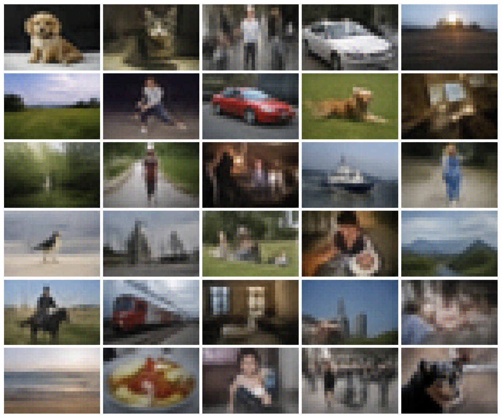
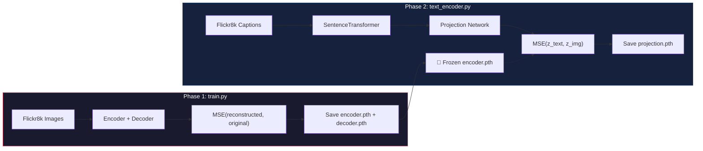

# 🧠 Text-to-Image through Latent Representations

[](https://pytorch.org/)
[](https://www.sbert.net/)
[](https://pytorch.org/vision/stable/models.html)
[](https://www.kaggle.com/datasets/adityajn105/flickr8k)
[](https://www.python.org/)
[](LICENSE)

An experimental multimodal generative AI system that explores learning a **shared latent space** between images and natural language — enabling text prompts to be decoded into images by bridging two entirely different modalities through representation learning.

> **⚠️ This is not a production image generator.** This is a hands-on learning experiment designed to build intuition around how systems like DALL·E, Stable Diffusion, and CLIP work under the hood — by building a simplified version from scratch.

---

## 📸 Experimental Results

The image below is a grid of outputs generated by the model from various text prompts. These images are decoded from the shared latent space — text embeddings were projected into the image latent space and passed through the decoder.

<p align="center">
  
</p>

<p align="center"><i>🔍 Text prompts → Projection Network → Image Latent Space → Decoder → Generated Images</i></p>

### 🔬 Analyzing the Outputs

| Observation | Explanation |
|:---|:---|
| **Blurry outputs** | The decoder reconstructs from a heavily compressed 512-dim latent vector upsampled from 28×28 to 224×224 via bilinear interpolation |
| **Recognizable shapes** | The model learns rough semantic structure — dogs, people, grass, sky, cars are distinguishable as blobs of correct color and shape |
| **Color coherence** | The latent space captures dominant color distributions well (green grass, blue sky, dark backgrounds) |
| **No fine detail** | Expected — the model has no adversarial loss, no perceptual loss, and no diffusion process. It uses only MSE reconstruction |

> [!NOTE]
> The blurriness is a well-known property of autoencoders trained with pixel-level MSE loss. MSE penalizes pixel deviations equally, causing the model to learn the **average** of all plausible outputs — producing smooth, blurred reconstructions. This is exactly what makes GANs and diffusion models necessary for sharp image generation.

---

## 💡 The Core Idea — What is a Shared Latent Space?

Imagine you speak English and your friend speaks Japanese. Neither of you understands the other's language. But what if both of you could translate your thoughts into **the same universal thought-language** in your heads?

That's exactly what this project does with images and text.

```
  "A brown dog          ┌─────────────────┐        ┌───────────┐
   running on       ──▶ │  Text Encoder +  │──▶ z ──▶│  Image    │──▶  🖼️ Generated
   a street"             │  Projection Net  │        │  Decoder  │      Image
                         └─────────────────┘        └───────────┘

  🖼️ Training Image  ──▶ ┌─────────────────┐──▶ z ──▶┌───────────┐──▶  🖼️ Reconstructed
                          │  Image Encoder   │        │  Image    │      Image
                          │  (ResNet-18)     │        │  Decoder  │
                          └─────────────────┘        └───────────┘
                                    ▲                       ▲
                                    │     SAME z-space      │
                                    └───────────────────────┘
```

**The key insight:** If we can make both the image encoder and the text projection network produce similar vectors `z` for semantically related inputs, then the decoder (which only knows how to turn `z` into images) can decode text-derived vectors too.

### 🧭 Analogy: GPS Coordinates

Think of the latent space as a map:
- The **Image Encoder** learns to place every image at specific GPS coordinates on this map
- The **Text Projection Network** learns to place text descriptions at the **same GPS coordinates** as their corresponding images
- The **Image Decoder** knows how to reconstruct the scenery at any GPS coordinate

When you give it a new text prompt, it looks up the coordinates, and the decoder renders whatever lives there.

---

## 🏗️ Architecture Deep Dive


---

## 📦 Project Structure

```
Text-to-Image-Latent-Representations/
│
├── image_encoder.py        # 🔷 ResNet-18 backbone → 512-dim latent vectors
├── image_decoder.py        # 🔶 Transposed convolutions → image reconstruction
├── text_encoder.py         # 🟢 SentenceTransformer + Projection Network + training loop
├── dataset.py              # 📂 Custom PyTorch Dataset (Flickr8k with captions)
├── train.py                # 🏋️ Phase 1: Autoencoder training (encoder + decoder)
├── inference.py            # 🚀 Text → latent → image generation pipeline
├── utils.py                # 🔧 Dataset download utility (Kaggle → local)
├── __init__.py             # 📦 Package exports
│
├── encoder.pth             # 💾 Trained encoder weights (~44MB)
├── decoder.pth             # 💾 Trained decoder weights (~13MB)
├── projection.pth          # 💾 Trained projection network weights (~1.8MB)
│
├── generated_image.png     # 🖼️ Sample output grid
├── dataset/                # 📁 Flickr8k dataset (Images/ + captions.txt)
│   ├── Images/             #     ~8,091 JPEG images
│   └── captions.txt        #     ~40,455 image-caption pairs (CSV)
│
├── pyproject.toml          # ⚙️ Python project config & dependencies
├── uv.lock                 # 🔒 Dependency lock file
├── .python-version         # 🐍 Python 3.13
└── .gitignore              # 🚫 Ignore patterns
```

---

## 🧩 Module Documentation

### 1. Image Encoder (`image_encoder.py`)

**Purpose:** Compresses a 224×224×3 image into a compact 512-dimensional latent vector.

**Architecture:** Uses a pretrained **ResNet-18** backbone with its final classification layer (`fc`) replaced by `nn.Identity()`, exposing the 512-dim feature vector from the penultimate layer.

```python
class ImageEncoder(torch.nn.Module):
    def __init__(self):
        super().__init__()
        self.model = resnet18()
        # Remove the classification head (1000 classes) → expose 512-dim features
        self.model.fc = nn.Identity()

    def forward(self, image):
        return self.model(image)  # Output: (batch_size, 512)
```

**Why ResNet-18?** It provides a strong, well-studied visual feature extractor. By removing the final classification layer, we repurpose it as a general-purpose image encoder that outputs dense, semantically meaningful feature vectors.

---

### 2. Image Decoder (`image_decoder.py`)

**Purpose:** Reconstructs a 224×224×3 image from a 512-dimensional latent vector.

**Architecture:**
1. **Fully connected layer:** `512 → 128 × 7 × 7 = 6,272` — reshapes the flat vector into a spatial feature map
2. **Transposed Convolution 1:** `128 → 64` channels, upsamples `7×7 → 14×14`
3. **Transposed Convolution 2:** `64 → 64` channels, upsamples `14×14 → 28×28`
4. **1×1 Convolution:** `64 → 3` channels (RGB)
5. **Bilinear Interpolation:** `28×28 → 224×224`

```python
class ImageDecoder(nn.Module):
    def __init__(self, latent_dim=512):
        super().__init__()
        self.fc = nn.Linear(latent_dim, 128 * 7 * 7)
        self.deconv1 = nn.ConvTranspose2d(128, 64, kernel_size=4, stride=2, padding=1)  # 7→14
        self.deconv2 = nn.ConvTranspose2d(64, 64, kernel_size=4, stride=2, padding=1)   # 14→28
        self.to_rgb  = nn.Conv2d(64, 3, kernel_size=3, padding=1)                       # →RGB
```

**Why bilinear interpolation at the end?** The decoder only learns to generate 28×28 spatial features. Rather than adding more transposed convolution layers (which would increase model complexity and training time), bilinear interpolation provides a simple upsampling to the target 224×224 resolution. This is also one of the primary sources of blurriness in the output.

---

### 3. Text Encoder & Projection Network (`text_encoder.py`)

This file contains **two** critical components:

#### 🅰 SentenceTransformer (Frozen, Pretrained)

```python
text_model = SentenceTransformer("all-MiniLM-L6-v2")
```

**What it does:** Converts any English sentence into a 384-dimensional embedding vector that captures the semantic meaning of the text. This model is pretrained on over 1 billion sentence pairs and is used **frozen** — no fine-tuning is applied.

**Why `all-MiniLM-L6-v2`?** It's lightweight (~22M parameters), fast, and produces high-quality semantic embeddings. It can distinguish between "a dog running" and "a cat sleeping" in embedding space.

#### 🅱 Projection Network (Trainable)

```python
class TextProjection(nn.Module):
    def __init__(self):
        super().__init__()
        self.fc1 = nn.Linear(384, 512)   # Match SentenceTransformer output → latent dim
        self.relu = nn.ReLU()
        self.fc2 = nn.Linear(512, 512)   # Refine the projection
```

**What it does:** Maps the 384-dim text embedding into the 512-dim **image latent space**. This is the bridge that aligns text and images.

**How it's trained:** For each (image, caption) pair in the dataset:
1. The **frozen** image encoder produces `z_img` (the "ground truth" latent vector)
2. The SentenceTransformer produces a text embedding from the caption
3. The projection network maps the text embedding to `z_text`
4. MSE Loss minimizes `||z_text - z_img||²`

---

### 4. Custom Dataset (`dataset.py`)

**Purpose:** Loads the Flickr8k dataset, providing `(image_tensor, caption_string)` pairs.

| Component | Details |
|:---|:---|
| **Source** | Flickr8k — ~8,091 images with ~5 captions each |
| **Format** | CSV with columns `image`, `caption` |
| **Image Transform** | Resize → 224×224, ToTensor, Normalize (ImageNet stats) |
| **Total Pairs** | ~40,455 image-caption pairs |

```python
self.transform = transforms.Compose([
    transforms.ToPILImage(),
    transforms.Resize((224, 224)),
    transforms.ToTensor(),
    transforms.Normalize(mean=[0.485, 0.456, 0.406], std=[0.229, 0.224, 0.225])
])
```

**Why ImageNet normalization?** Since the ResNet-18 encoder was originally trained on ImageNet, using the same normalization statistics ensures the input distribution matches what ResNet expects, leading to better feature extraction.

---

## 🔄 Training Pipeline

The training happens in **two sequential phases:**



### Phase 1 — Autoencoder Training (`train.py`)

**Goal:** Teach the encoder to compress images into meaningful latent vectors, and the decoder to reconstruct images from those vectors.

```
Image → Encoder → z (512-dim) → Decoder → Reconstructed Image
                                              ↕ MSE Loss
                                          Original Image
```

| Hyperparameter | Value |
|:---|:---|
| Batch Size | 4 |
| Learning Rate | 1e-3 |
| Optimizer | Adam |
| Loss Function | MSE (Mean Squared Error) |
| Epochs | 5 |
| Device | MPS (Apple Silicon) / CPU |

**What happens here:**
1. Each image is passed through the encoder → 512-dim vector
2. The decoder tries to reconstruct the original image from this vector
3. MSE Loss measures pixel-level difference between original and reconstruction
4. Both encoder and decoder weights are updated via backpropagation

**After training:** The encoder and decoder weights are saved as `encoder.pth` and `decoder.pth`.

---

### Phase 2 — Projection Training (`text_encoder.py`)

**Goal:** Train a small neural network to translate text embeddings into the image latent space.

```
Caption → SentenceTransformer → 384-dim → Projection → z_text (512-dim)
                                                            ↕ MSE Loss
Image   → 🧊 Frozen Encoder  → z_img (512-dim) ───────────┘
```

| Hyperparameter | Value |
|:---|:---|
| Batch Size | 4 |
| Learning Rate | 1e-3 |
| Optimizer | Adam |
| Loss Function | MSE |
| Epochs | 5 |
| Frozen Components | Image Encoder, SentenceTransformer |

**What happens here:**
1. The image encoder (now **frozen**) produces the target latent vector `z_img`
2. The SentenceTransformer encodes the corresponding caption (also **frozen**)
3. Only the Projection Network is trainable — it learns to map 384-dim text → 512-dim image latent space
4. MSE Loss minimizes `||z_text - z_img||²`

> [!IMPORTANT]
> The encoder must be frozen during Phase 2. If it were still training, the latent space would keep shifting, and the projection network would be chasing a moving target — making convergence impossible.

**After training:** The projection weights are saved as `projection.pth`.

---

## 🚀 Inference Pipeline (`inference.py`)

At inference time, all three models are loaded and set to evaluation mode. A new text prompt flows through the pipeline:

```
"A brown dog running on a street."
         │
         ▼
┌──────────────────────────┐
│   SentenceTransformer    │  (Frozen, pretrained)
│   all-MiniLM-L6-v2       │
│   Output: 384-dim        │
└──────────┬───────────────┘
           ▼
┌──────────────────────────┐
│   Projection Network     │  (Trained in Phase 2)
│   384 → 512 → 512        │
│   Output: 512-dim        │
└──────────┬───────────────┘
           ▼
┌──────────────────────────┐
│   Image Decoder          │  (Trained in Phase 1)
│   512 → 6272 → 28×28     │
│   → bilinear → 224×224   │
└──────────┬───────────────┘
           ▼
    🖼️ Generated Image
       (saved as PNG)
```

The output tensor is post-processed by:
1. Removing the batch dimension
2. Permuting from `(C, H, W)` → `(H, W, C)` for OpenCV
3. Normalizing pixel values to `[0, 255]`
4. Converting RGB → BGR (OpenCV convention)
5. Saving as `generated_image.png`

---

## 🔧 Installation & Setup

### Prerequisites

- **Python 3.13+**
- **[uv](https://docs.astral.sh/uv/)** package manager (recommended) or `pip`
- ~2GB disk space for dataset + model weights
- **Kaggle API key** (for dataset download) — [Setup Guide](https://www.kaggle.com/docs/api#getting-started-installation-&-authentication)

### Step 1 — Clone the Repository

```bash
git clone https://github.com/AKASH-KUMAR-BARPANDA/Text-to-Image-Latent-Representations.git
cd Text-to-Image-Latent-Representations
```

### Step 2 — Create Virtual Environment & Install Dependencies

**Using `uv` (recommended):**
```bash
uv sync
```

**Using `pip`:**
```bash
python -m venv .venv
source .venv/bin/activate  # On Windows: .venv\Scripts\activate
pip install torch torchvision sentence-transformers kagglehub opencv-python pandas
```

### Step 3 — Download the Dataset

The project uses the **Flickr8k** dataset from Kaggle. The `utils.py` script automates the download:

```bash
uv run python utils.py
```

This will:
1. Download the Flickr8k dataset via `kagglehub`
2. Copy it to the local `dataset/` directory
3. The dataset contains `Images/` (8,091 JPEGs) and `captions.txt` (~40K caption pairs)

> [!NOTE]
> You need a Kaggle API key configured. Place your `kaggle.json` in `~/.kaggle/` or set the `KAGGLE_USERNAME` and `KAGGLE_KEY` environment variables.

### Step 4 — Update Dataset Paths

Before training, update the hardcoded dataset paths in `train.py` and `text_encoder.py` to match your local directory:

```python
# In train.py and text_encoder.py, update these lines:
dataset = customdataset(
    imageDir="<your-path>/dataset/Images",
    caption="<your-path>/dataset/captions.txt"
)
```

---

## 🏋️ Training

### Phase 1 — Train the Autoencoder

```bash
uv run python train.py
```

This trains the Image Encoder + Image Decoder end-to-end on the Flickr8k images. Outputs: `encoder.pth` and `decoder.pth`.

### Phase 2 — Train the Projection Network

```bash
uv run python text_encoder.py
```

This freezes the encoder from Phase 1 and trains the Projection Network to align text embeddings with image latent vectors. Output: `projection.pth`.

> [!TIP]
> Training on Apple Silicon? The code automatically uses MPS acceleration. On other hardware, it will fall back to CPU. For CUDA-enabled GPUs, modify the device line:
> ```python
> device = "cuda" if torch.cuda.is_available() else "cpu"
> ```

---

## 🎨 Running Inference

```bash
uv run python inference.py
```

**Default prompt:** `"A brown dog running on a street."`

To change the prompt, edit the `caption` variable in `inference.py`:

```python
caption = [
    "A sunset over the ocean"
]
```

The generated image will be saved as `generated_image.png` in the project root.

---

## 🧪 Reproduce the Full Experiment (End-to-End)

```bash
# 1. Clone and setup
git clone https://github.com/AKASH-KUMAR-BARPANDA/Text-to-Image-Latent-Representations.git
cd Text-to-Image-Latent-Representations
uv sync

# 2. Download dataset
uv run python utils.py

# 3. Update dataset paths in train.py and text_encoder.py

# 4. Train the autoencoder (Phase 1)
uv run python train.py

# 5. Train the projection network (Phase 2)
uv run python text_encoder.py

# 6. Generate images from text
uv run python inference.py

# 7. Check the output
open generated_image.png
```

---

## 🤔 Why Are the Images Blurry? (And Why That's OK)

The blurriness is not a bug — it's a **fundamental limitation** of the approach, and understanding it is the whole point of this experiment:

### 1. MSE Loss Averages Everything

MSE loss computes the mean squared pixel difference. When multiple plausible outputs exist (a dog could face left or right), MSE produces the **average** — which is blurry. This is why state-of-the-art models use:
- **Adversarial losses** (GANs) — reward sharpness
- **Perceptual losses** — compare high-level features, not pixels
- **Diffusion processes** — iteratively refine noise into sharp images

### 2. Extreme Compression Bottleneck

A 224×224×3 image has **150,528** values. The latent vector has only **512**. That's a **294× compression ratio**. Some information is inevitably lost.

### 3. Upsampling from 28×28

The decoder only generates 28×28 spatial features, then uses bilinear interpolation to reach 224×224. This 8× upsampling inherently smooths out details.

### 4. Cross-Modal Alignment Is Hard

Perfectly mapping a text sentence to the exact image latent vector is an extraordinarily difficult task. The projection network introduces its own approximation error.

> [!TIP]
> **What would make this better?** Adding a GAN discriminator, using perceptual loss (VGG-based), increasing decoder capacity, using a VAE or diffusion-based decoder, training on a larger dataset, and training for many more epochs.

---

## 📚 What This Experiment Teaches

This project is designed to build intuition around several foundational concepts in modern AI:

| Concept | Where It Appears |
|:---|:---|
| **Autoencoders** | `train.py` — learning compressed representations |
| **Representation Learning** | The encoder learns a 512-dim space where similar images cluster together |
| **Transfer Learning** | ResNet-18 features are repurposed as an image encoder |
| **Multimodal Learning** | Bridging text and image modalities via a shared space |
| **Cross-Modal Alignment** | The Projection Network learns to translate between embedding spaces |
| **Semantic Embedding Spaces** | SentenceTransformer places similar sentences near each other |
| **Text-Conditioned Generation** | `inference.py` — generating images from text descriptions |
| **Latent Space Arithmetic** | The shared z-space enables text→image translation |

---

## 🛠️ Tech Stack

| Component | Technology | Role |
|:---|:---|:---|
| Image Encoder | ResNet-18 (torchvision) | Visual feature extraction |
| Image Decoder | ConvTranspose2d + Bilinear | Image reconstruction |
| Text Encoder | all-MiniLM-L6-v2 (SentenceTransformers) | Semantic text embedding |
| Projection | 2-layer MLP with ReLU | Cross-modal alignment |
| Dataset | Flickr8k (Kaggle) | 8K images + 40K captions |
| Training | PyTorch (MPS/CUDA/CPU) | Autograd-based optimization |
| Inference | OpenCV | Image post-processing & saving |
| Package Manager | uv | Dependency management |

---

## 📖 Related Work & Further Reading

This experiment is a simplified version of ideas from these landmark papers:

- **CLIP** (Radford et al., 2021) — Contrastive learning of image-text pairs with separate encoders
- **DALL·E** (Ramesh et al., 2021) — Text-to-image generation via discrete VAE + autoregressive transformer
- **Stable Diffusion** (Rombach et al., 2022) — Latent diffusion models for high-resolution image synthesis
- **ALIGN** (Jia et al., 2021) — Scaling visual-language representation learning with noisy text
- **Auto-Encoding Variational Bayes** (Kingma & Welling, 2014) — The foundational VAE paper

---

## 🙋 Author

**Akash Kumar Barpanda**

Built as a learning experiment to understand the foundations of multimodal AI and cross-modal generation.

---

<p align="center">
  <i>⭐ If you found this educational or interesting, consider starring the repo!</i>
</p>
